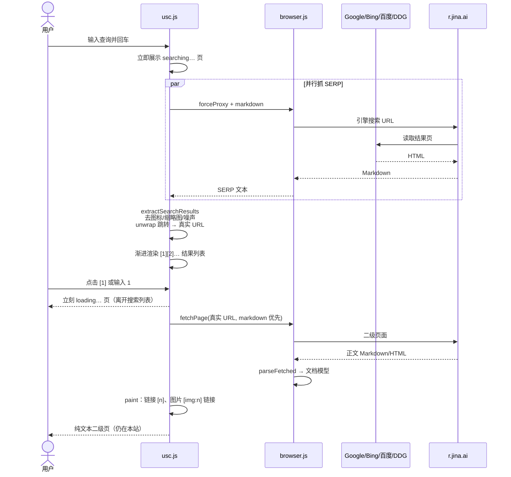
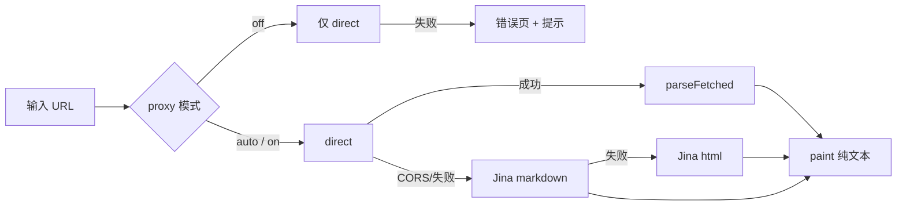

# USC

[中文](#中文) · [English](#english)

## 中文

USC 是运行在浏览器里的**极简纯文本浏览器**，也是 Google、Bing、百度的站内搜索入口。

没有后端、数据库或自建索引。网页被整理成可阅读文字；链接显示为 `[1] [2]`；**图片默认只显示为文本链接** `[img:n]`，由你决定是否加载。

### 启动

推荐用本地 HTTP 打开（不要依赖 `file://`）：

```bash
python3 -m http.server 8765
```

访问 `http://127.0.0.1:8765/`。无第三方依赖。

### 安装与分享

这是可安装的应用壳（PWA），不是调试页：

- 浏览器菜单 → **添加到主屏幕** / 安装应用（`install` 会提示这一步）
- 离线时首页、设置、帮助、书签仍可用；读过的页面会保存在本机，刷新或下次打开仍能从 **continue** 立刻回到正文（滚动位置也记得）
- 打开或分享这些地址会直接进入对应页（地址栏保持可分享，不含 `#usc-N`）：

```text
/?q=量子计算
/?url=https://en.wikipedia.org/wiki/Plain_text
/?p=settings
/?p=bookmarks
/?p=help
```

系统「分享到 USC」走同一套参数（`title` / `text` / `url`）。

### 基本使用

底部输入框同时是搜索框和地址栏：

- 输入文字并回车 → 在 **USC 内**汇总搜索结果（标题 / 站点 / 摘要）
- 输入编号或点击结果 → 打开**二级页面正文**（纯文本，仍留在 USC）
- 输入网址并回车 → 读取该页正文
- 图片以 `[img:n …]` 链接展示；点击或 `i n` 才加载

```text
› 量子计算
› 1
› i 1
› back
```

搜索引擎自己的结果页 UI **不会**成为 USC 的页面；需要系统浏览器时用 `real` / `real <n>`。

### 常用命令

| 命令 | 作用 |
|---|---|
| `back` / `forward` / `home` | 后退、前进、首页 |
| `help` | 简短帮助 |
| `i 1` / `i all` | 加载一张 / 全部图片链接 |
| `i on` / `i off` | 以后自动 / 不自动加载图片 |
| `g <词>` / `b <词>` / `d <词>` | 只使用 Google / Bing / 百度 |
| `s <词>` | 强制搜索与命令同名的词，例如 `s back` |
| `real` / `real <n>` | 在系统浏览器中打开当前页 / 链接 n |
| `find <词>` | 页内查找 |
| `bookmark` / `star` / `bookmarks` | 收藏当前页（再一次取消）/ 打开书签 |
| `history` / `resume` | 本会话历史 / 打开上次页面 |
| `settings` | 主题、代理、图片、字号、清空最近 |
| `proxy auto` / `on` / `off` | 自动 / 允许 / 禁止 Jina（默认 `auto`） |
| `theme` / `theme dark` / `light` / `system` | 循环或指定明暗（也可用右下角按钮或 `Alt+T`） |
| `font +` / `-` / `reset` | 字号 |
| `copy` / `copy <n>` | 复制当前 URL / 链接 n |
| `share` | 系统分享，失败则复制 URL |
| `install` | 提示如何添加到主屏幕 |
| `top` / `bottom` | 跳到顶部 / 底部 |

输入 `:` 打开命令联想。空输入时按空格翻页；`Esc` 停止加载。`Ctrl/Cmd + L` 聚焦输入，`Alt + T` 循环主题。

右下角 `dark` / `light` / `auto` 可点：暗色 → 亮色 → 跟随系统。偏好保存在本机。

### 跨域与隐私

默认 `proxy auto`：

1. 先由浏览器**直接**请求目标页  
2. 若 CORS / 网络失败，再经 [Jina Reader](https://r.jina.ai/) 取**可读文本（markdown 优先）**  
3. 状态栏出现 `via jina` 表示走了代理  

站内搜索、以及从搜索结果打开的二级页，为了稳定拿到正文，会优先经 Jina 取 markdown。  
`proxy off` 完全禁止代理；`proxy on` 始终允许。偏好存在 `localStorage`。刷新后首页会显示 **continue**（上次页面或搜索）和 **recent**；`resume` 直接打开上次内容。

---

### 架构

#### 文件职责

```text
index.html     纯文本 UI、明暗主题、手机适配
favicon.svg    图标
icon-192.png / icon-512.png / apple-touch-icon.png
manifest.json  可安装应用、快捷方式、分享入口
sw.js          离线应用壳
browser.js     取页、CORS/Jina、HTML/Markdown → 文档模型、纯文本导出
library.js     本地知识层：usc.local 路由、启动参数、最近/继续/书签、已读页面、产品页 markdown
search.js      搜索引擎、SERP 抽取/去噪、结果页文档
usc.js         命令解析、go 导航内核、历史栈、主题、渲染与交互
usc.test.js    无依赖单元测试
```

产品页（首页、设置、历史、书签、帮助、关于）都是 **usc.local 上的 markdown 文档**。所有打开动作走同一套 `go(url)`：`Library.surface(url)` 决定本地页，搜索走 `search.js`，其余才 fetch。`usc.local` **从不发起网络请求**。已读远程页保存在本机：再次打开（continue / 书签 / 后退）立刻出正文并恢复滚动；未读过的远程页先换成 loading，再换成正文或错误页。

#### 总览

```mermaid
flowchart TB
  subgraph UI["界面 index.html"]
    PAGE["#page 正文"]
    CHROME["#chrome 状态 / 提示 / 输入"]
  end

  subgraph SHELL["应用壳"]
    SW["sw.js 离线缓存"]
    LAUNCH["?q= · ?url= · ?p= · 分享"]
  end

  subgraph APP["usc.js"]
    PARSE["parseLine 命令解析"]
    NAV["go · Library.surface"]
    PAINT["paint 纯文本渲染"]
  end

  subgraph SEARCHMOD["search.js"]
    SEARCH["引擎 / SERP 抽取 / 结果页"]
  end

  subgraph LIB["library.js"]
    HOME["home / settings / history / help"]
    SESSION["recents + saved pages"]
    ROUTE["surface(url)"]
  end

  subgraph CORE["browser.js"]
    FETCH["fetchPage"]
    DIRECT["fetchDirect"]
    JINA["fetchJina markdown→html"]
    DOC["parseFetched → tokens/links/images"]
  end

  CHROME -->|Enter| PARSE
  LAUNCH --> NAV
  SW --> UI
  PARSE -->|search| SEARCH
  PARSE -->|url / 编号 / 本地页| NAV
  SEARCH -->|结果页文档| PAINT
  NAV -->|usc.local| ROUTE
  ROUTE --> HOME
  HOME --> SESSION
  SESSION --> PAINT
  NAV -->|http(s)| FETCH
  FETCH --> DIRECT
  DIRECT -->|失败且允许代理| JINA
  DIRECT --> DOC
  JINA --> DOC
  DOC --> PAINT
  PAINT --> PAGE
```

#### 搜索 → 二级正文（核心路径）



#### 单页读取（地址栏 URL）



#### 文档模型与渲染

```text
Fetched text
    │
    ├─ HTML  → DOMParser（或小型 tokenizer）
    └─ Markdown → markdownToDocument
            │
            ▼
     Document {
       title, url, via,
       tokens: text | nl | link{n,url} | img{n,url,alt,loaded},
       links[], images[]
     }
            │
            ▼
     paint():
       link  → [n] 标题     （data-url，点击站内打开）
       img   → [img:n alt] （文本链接；点击或 i n 才加载 ）
     markdown 会去掉脚注、表格线、*强调*，并识别 [text](url "title")
     远程文章在 References 等附录处截断，并跳过 File/Help 等维基零件链接
     维基 infobox 表、[citation needed] 一类编辑标记不会进入正文
```

#### 模块边界

| 层 | 负责 | 不负责 |
|---|---|---|
| `index.html` | 布局、主题变量、手机安全区/键盘 | 业务逻辑 |
| `browser.js` | HTTP(S) 安全、取页、解析、纯文本 | 命令、历史、搜索策略 |
| `library.js` | usc.local 路由与产品页 markdown、会话 | 取页、SERP、渲染 |
| `search.js` | 引擎、SERP 抽取/去噪、搜索结果文档 | 历史栈、paint |
| `usc.js` | 命令、`go` 内核、历史、书签存储、渲染交互 | 原始 HTML 解析、SERP 细节 |

```bash
node usc.test.js
```

### 限制

- 半搜索引擎：不建索引、不执行目标站 JavaScript。  
- 依赖浏览器网络；Jina 不可用时部分站点读不到。已读过的页面可在离线时打开。  
- 加载超时 15s；最近约 20 页保存在本机、每页约 20 万字符；正文约 12 万字符后截断。
- 安装与离线需要 HTTP(S)，不要用 `file://`。

---

## English

USC is a **minimal plain-text browser** that runs entirely in your browser, plus an in-app entry point for Google, Bing, and Baidu.

There is no backend or private index. Pages become readable text; links are `[1] [2]`; **images are text links** `[img:n]` until you choose to load them.

### Start

Prefer a local HTTP server (avoid `file://`):

```bash
python3 -m http.server 8765
```

Visit `http://127.0.0.1:8765/`. No third-party dependencies.

### Install and share

USC is an installable app shell (PWA):

- Browser menu → **Add to Home Screen** / Install (`install` reminds you)
- Home, settings, help, and bookmarks still work offline; pages you already read are kept on this device, so **continue** opens the article immediately (scroll position included)
- These URLs open the matching surface (the address bar stays shareable; no `#usc-N`):

```text
/?q=quantum
/?url=https://en.wikipedia.org/wiki/Plain_text
/?p=settings
/?p=bookmarks
/?p=help
```

Sharing into USC uses the same `title` / `text` / `url` query params.

### Basic use

The bottom field is both search box and address bar:

- Type text → in-app result list (title / host / snippet)  
- Type a number or click a result → open the **secondary page as text** inside USC  
- Type a URL → read that page as text  
- Images stay `[img:n …]` links until click / `i n`

Type `:` to open command suggestions. With an empty prompt, Space scrolls; `Esc` stops loading. `Ctrl/Cmd + L` focuses the prompt, `Alt + T` cycles the theme.

The `dark` / `light` / `auto` control at the bottom right cycles appearance. The choice is stored in this browser.

### Common commands

| Command | Action |
|---|---|
| `back` / `forward` / `home` | History / home |
| `help` | Short help |
| `i 1` / `i all` | Load one / all image links |
| `i on` / `i off` | Always / never auto-load images |
| `g` / `b` / `d` | Google / Bing / Baidu only |
| `s <query>` | Search a reserved word |
| `real` / `real <n>` | Open outside |
| `find` / `star` / `bookmarks` | Find / save page (again to unstar) / bookmarks |
| `history` / `resume` / `settings` | Session history / last page / preferences |
| `theme` / `theme dark` / `light` / `system` | Cycle or set appearance (also the bottom-right control or `Alt+T`) |
| `share` / `install` | Share this page / Home Screen hint |

### Cross-origin and privacy

Default `proxy auto`: try a direct fetch, then [Jina Reader](https://r.jina.ai/) (markdown first) when blocked. In-app search and secondary pages from search prefer Jina markdown for stable article text. `proxy off` disables the proxy; `proxy on` always allows it.

After a refresh, home shows **continue** (last page or search) and **recent**. `resume` opens the last item immediately.

---

### Architecture

#### Files

```text
index.html     Text UI, light/dark theme, mobile chrome
favicon.svg    Icon
icon-192.png / icon-512.png / apple-touch-icon.png
manifest.json  Installable app, shortcuts, share target
sw.js          Offline app shell
browser.js     Fetch, Jina, HTML/Markdown → document model
library.js     usc.local routing, launch query, recents, saved pages, product-page markdown
search.js      Engines, SERP extract/denoise, search-hub documents
usc.js         Commands, go() kernel, history stack, theme, paint
usc.test.js    Dependency-free tests
```

Product surfaces (home, settings, history, bookmarks, help, about) are **markdown documents on usc.local**. Every open goes through `go(url)`: `Library.surface(url)` for app pages, `search.js` for the search hub, otherwise fetch. Host `usc.local` is **never fetched from the network**. Pages you already read are kept on device: continue / bookmarks / back open instantly and restore scroll. A new remote page still shows loading, then article text or an error.

#### Overview

```mermaid
flowchart TB
  subgraph UI["index.html"]
    PAGE["#page"]
    CHROME["prompt / status"]
  end

  subgraph SHELL["app shell"]
    SW["sw.js"]
    LAUNCH["?q= · ?url= · ?p="]
  end

  subgraph APP["usc.js"]
    PARSE["parseLine"]
    NAV["go · Library.surface"]
    PAINT["paint"]
  end

  subgraph SEARCHMOD["search.js"]
    SEARCH["engines / SERP / hub"]
  end

  subgraph LIB["library.js"]
    HOME["home / settings / history / help"]
    SESSION["recents + saved pages"]
    ROUTE["surface(url)"]
  end

  subgraph CORE["browser.js"]
    FETCH["fetchPage"]
    DIRECT["direct"]
    JINA["Jina markdown→html"]
    DOC["parseFetched"]
  end

  CHROME --> PARSE
  LAUNCH --> NAV
  SW --> UI
  PARSE -->|search| SEARCH
  PARSE -->|follow / local page| NAV
  SEARCH --> PAINT
  NAV -->|usc.local| ROUTE
  ROUTE --> HOME
  HOME --> SESSION
  SESSION --> PAINT
  NAV -->|http(s)| FETCH
  FETCH --> DIRECT
  DIRECT -->|fail + proxy| JINA
  DIRECT --> DOC
  JINA --> DOC
  DOC --> PAINT
  PAINT --> PAGE
```

#### Search → secondary article text

```mermaid
sequenceDiagram
  actor U as User
  participant USC as usc.js
  participant BR as browser.js
  participant J as r.jina.ai

  U->>USC: query
  USC->>BR: SERP via Jina markdown
  BR->>J: engine search URL
  J-->>USC: markdown
  USC->>USC: extract results (drop thumbs/icons)<br/>unwrap redirects
  USC-->>U: [1][2] text list
  U->>USC: open [1]
  USC-->>U: loading… page (leaves the result list immediately)
  USC->>BR: article URL, markdown preferred
  BR->>J: secondary page
  J-->>USC: article text
  USC-->>U: plain-text page; images as [img:n] links
```

#### Document model

```text
tokens: text | nl | link | img(loaded flag)
paint:  [n] title     → in-app navigation
        [img:n alt]   → text link until user loads it
markdown: links with "titles", skip footnotes, flatten tables, strip *emphasis*
        cut remote articles at References; skip wiki File/Help chrome
        drop leading Wikipedia infobox tables and editorial [citation needed] marks
```

```bash
node usc.test.js
```

### Limitations

- Half search engine: no crawl/index; target-page JS is not executed.  
- Needs network; if Jina is unreachable some sites cannot be read. Pages already read can open offline.  
- 15s load timeout; about 20 saved pages on device; ~120k character truncation.
- Install and offline need HTTP(S); do not use `file://`.
